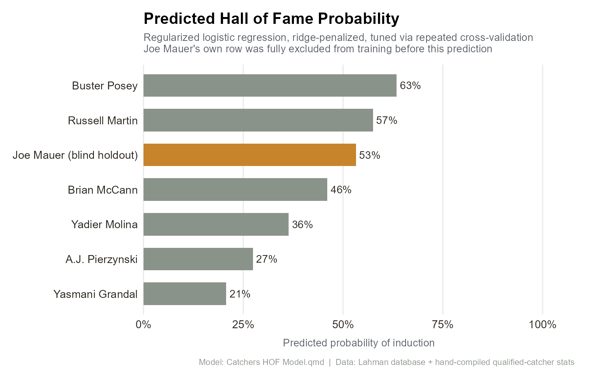
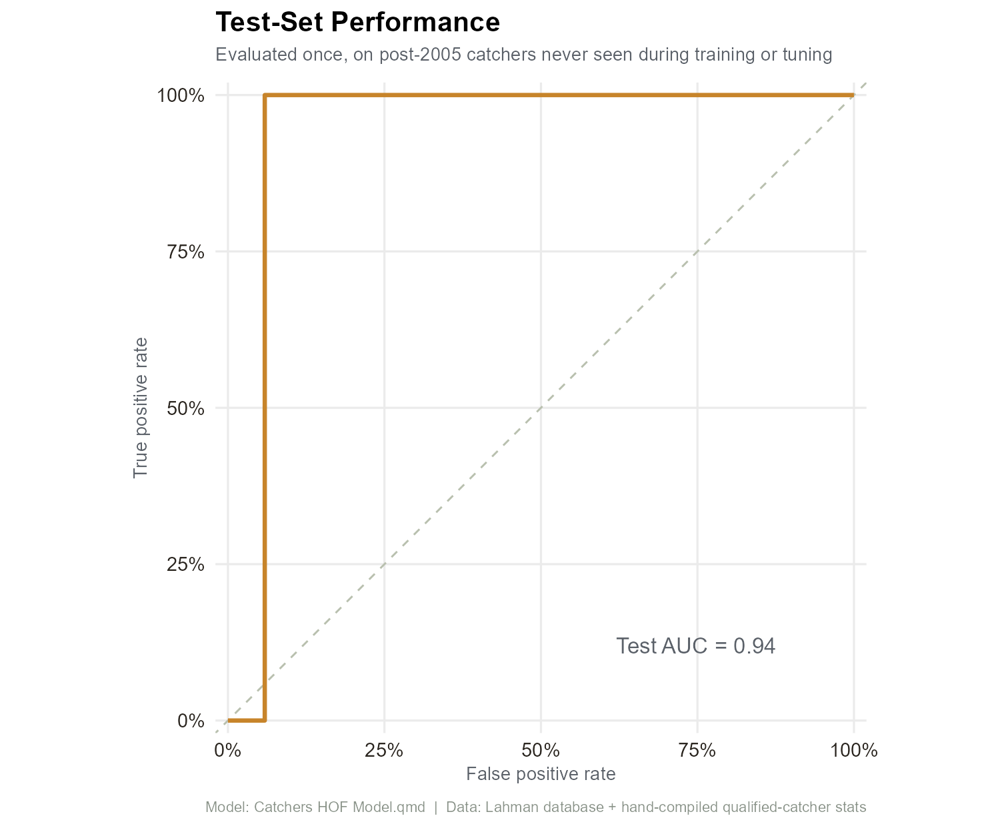

# Predicting Hall of Fame Catchers

A regularized logistic regression model that estimates a modern MLB catcher's probability of Hall of Fame induction, built from the Lahman baseball database plus a hand-compiled stats file for all qualified catchers.

## The question

Given a catcher's career performance (WAR, offensive production, defense, awards, All-Star selections), what's their statistical probability of making the Hall of Fame?

## Approach

- Started from a manually compiled spreadsheet of every qualified catcher's career stats, and matched each one to their Lahman `playerID` — including a manual name-mapping table for players Lahman's fuzzy matching missed (accented names, suffixes like Jr./Sr., etc.)
- Joined in All-Star selections, Gold Gloves, Silver Sluggers, and MVP awards from Lahman's award tables
- Labeled each player as a Hall of Famer (1), a resolved non-Hall of Famer (0 — retired long enough ago that their HOF case is settled), or unresolved (excluded from training — still active or too recently retired to judge)
- Split the labeled data by career end year (cutoff: 2005) so the model trains on earlier careers and tests on more recent ones, rather than a random split
- Built a `tidymodels` recipe (median imputation + normalization) feeding a ridge-penalized logistic regression (`glmnet`), with the penalty tuned via 5-fold, 10-repeat cross-validation optimizing ROC AUC
- Fit the final model on the training set and evaluated on the held-out modern-era catchers

## Results

Evaluated once, on the held-out modern-era catchers: **0.94 AUC**, 95% accuracy, 100% sensitivity, 94.1% specificity. Encouraging, but read with real skepticism — the test set is small, since only a handful of catchers' careers both ended after 2005 and are resolved (long enough ago to have a settled Hall of Fame outcome).

## A fun final test

As a last step, the model is retrained with Joe Mauer's row fully removed from training and tuning, then used to predict Mauer's own Hall of Fame probability from his career stats alone — a clean way to sanity-check the model against a real, well-known case without letting his row leak into training.

## Files

- `Catchers HOF Model.qmd` — full data pipeline, feature engineering, model tuning, and evaluation
- `All Qualified Catchers Stats.xlsx` — the underlying dataset of career stats for every qualified catcher
- `hof_probability_chart.R` — re-runs the pipeline end-to-end and renders both charts above (never reads in saved predictions, so they always reflect the actual fitted model)
- `hof_probability_chart.png`, `hof_roc_curve.png` — the rendered charts

## Tech

R, tidyverse, tidymodels, glmnet, the Lahman baseball database
